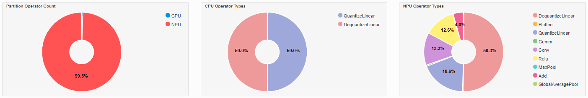
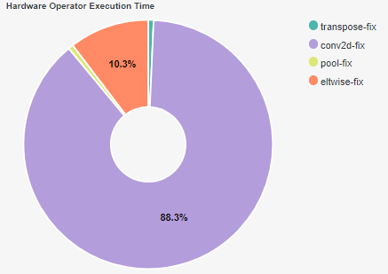
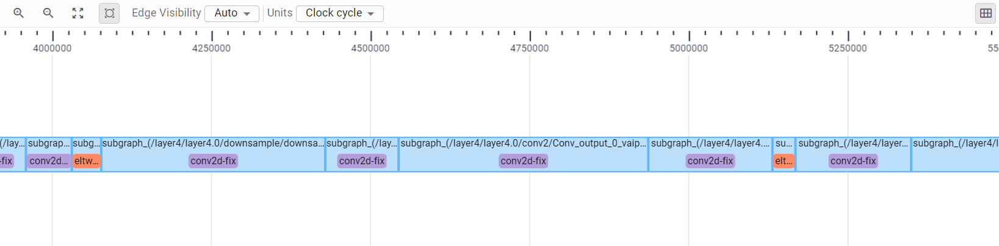

###################
AI Analyzer
###################

AMD AI Analyzer is a tool that supports analysis and visualization of model compilation and inference on the the Ryzen AI NPU. The primary goal of the tool is to help users better understand how the models are processed by the hardware, and to identify performance bottlenecks that may be present during model inference. Using the AI Analyzer, users can effectively visualize graph and operator partitions between the NPU and CPU. 

********
Features
********

The AI Analyzer includes the following features and capabilities: 

1. Graph partitions: The tool presents the user with a picture of how the model is paritioned across the CPU and NPU.
2. Operator Fusion: In addition to partitioning, AI Analyzer also presents the user with a picture of how operators have been fused by the compiler. 
3. Inference Profile: The tool provides a breakdown and visualization of inference timing. For this, a Gantt chart of operators is provided. This chart can also be cross-probed to the fused graph.

************
Installation 
************

If you installed the Ryzen AI software using automatic installer, AI Analyzer is already installed in the conda environment. 

If you manually installed the software, you will need to install the AI Analyzer wheel file in your environment. 

.. code-block:: bash 

   python -m pip install path\to\RyzenAI\installation\files\aianalyzer-<version>.whl

************************************
Enabling Profiling and Visualization
************************************

Profiling and Visualization can be enabled by passing additional provider options to the ONNXRuntime Inference Session. An example is shown below: 

.. code-block::

   provider_options = [{
                'config_file': 'vaip_config.json',
                'cacheDir': str(cache_dir),
                'cacheKey': 'modelcachekey', 
                'ai_analyzer_visualization': True,
                'ai_analyzer_profiling': True,
            }]
  session = ort.InferenceSession(model.SerializeToString(), providers=providers,
                               provider_options=provider_options)

|

The ``ai_analyzer_profiling`` flag enables generation of artifacts related to the inference profile. The ``ai_analyzer_visualization`` flag enables generation of artifacts related to graph partitions and operator fusion. These artifacts are generated as .json files in the current run directory.

AI Analyzer also supports native ONNX Runtime profiling, which can be used to analyze the parts of the session running on the CPU. Users can enable ONNX Runtime profiling through session options and pass it alongside the provider options as shown below:

.. code-block::

   # Configure session options for profiling
   sess_options = rt.SessionOptions()
   sess_options.enable_profiling = True

   provider_options = [{
                'config_file': 'vaip_config.json',
                'cacheDir': str(cache_dir),
                'cacheKey': 'modelcachekey', 
                'ai_analyzer_visualization': True,
                'ai_analyzer_profiling': True,
            }]

  session = ort.InferenceSession(model.SerializeToString(), sess_options, providers=providers,
                               provider_options=provider_options)

*********************
Launching AI Analyzer
*********************

Once the artifacts are generated, `aianalyzer` can be invoked through the command line as follows: 

.. code-block:: bash

   aianalyzer <logdir> <additional options>

**Positional Arguments**

``logdir``
    Path to the folder containing generated artifacts 

**Additional Options**

-v, --version
    Show the version info and exit.

-b ADDR, --bind ADDR
    Hostname or IP address on which to listen, default is 'localhost'.

-p PORT, --port PORT
    TCP port on which to listen, default is '8000'.

-n, --no-browser
    Prevent the opening of the default url in the browser.

-t TOKEN, --token TOKEN
    Token used for authenticating first-time connections to the server.
    The default is to generate a new, random token.
    Setting to an empty string disables authentication altogether, which is NOT RECOMMENDED.

******************
Tutorial
******************

We can enable the AI Analyzer in the :doc:`Getting started with ResNet50 <getstartex>` example. To do this, open the ``predict.py`` script and modify the provider options as shown above . When this script is run, the profiling and visualization artifacts will be dumped as .json files in the current run directory.

Launch the AI Analyzer: 

.. code-block:: 

   aianalyzer <path to folder containing generated artifacts> --port=8087

Follow the link displayed to open the analyzer on your browser. The analyzer displays information such as operator partitioning and hardware execution times. Some of the information displayed for the ResNet50 example are shown below.

The following donut charts show operator partitioning across the CPU and the NPU:

|

|
|

A summary of operator execution times on the NPU is shown in the chart below:

|

|
|

The following Gantt chart provides a visualization of the inference timing: 

|

|
|

..
  ------------

  #####################################
  License
  #####################################

 Ryzen AI is licensed under `MIT License <https://github.com/amd/ryzen-ai-documentation/blob/main/License>`_ . Refer to the `LICENSE File <https://github.com/amd/ryzen-ai-documentation/blob/main/License>`_ for the full license text and copyright notice.
