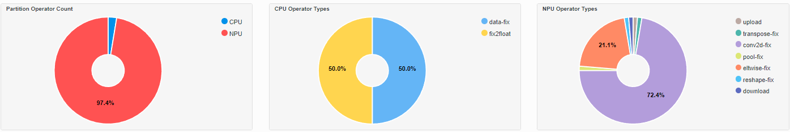

AI Analyzer
===========

AMD AI Analyzer is a powerful tool that supports analysis and visualization of model compilation and inference on the the Ryzen AI NPU. The primary goal of the tool is to help users better understand how the models are processed by the hardware, and to identify performance bottlenecks that may be present during model inference. Using the AI Analyzer, users can effectively visualize graph and operator partitions between the NPU and CPU. 

Features
###########

The AI Analyzer broadly has the following features: 

1. Graph partitions: The tool presents the user with a picture of how the model is paritioned across the CPU and NPU.
2. Operator Fusion: In addition to partitioning, AI Analyzer also presents the user with a picture of how operators have been fused by the compiler. 
3. Inference Profile: The tool provides a breakdown and visualization of inference timing. For this, a Gantt chart of operators is provided. This chart can also be cross-probed to the fused graph.

Installation 
###########

Ensure that the Ryzen AI Software  is correctly installed. For more details, see the :doc:`installation instructions <inst>`. If you installed the Ryzen AI software using automatic installer, AI Analyzer is already installed in the conda environment. If you manually installed the software, you will need to install the aianlyzer wheel file in your environment. 

.. code-block:: bash 

   python -m pip install path\to\RyzenAI\installation\files\aianalyzer-<version>.whl

Enabling Profiling and Visualization
###########

Profiling and Visualization can be enabled by passing additional provider options to the ONNXRuntime Inference Session. An example is shown below: 

.. code-block::

   provider_options = [{
                'config_file': 'vaip_config.json',
                'cacheDir': str(cache_dir),
                'cacheKey': 'modelcachekey', 
                'ai_analyzer_visualization': True,
                'ai_analyzer_profiling': True,
            }]
  session = ort.InferenceSession(model.SerializeToString(), providers=providers,
                               provider_options=provider_options)

|

Analyzing ResNet50 
###########

We can enable the AI Analyzer in the :doc:`Getting started with ResNet50 <getstartex.rst>` example. To do this, modify the provider options as shown above in the ``predict.py`` script. When this script is run, the following artifacts will be dumped in the run directory: 

1. record_timer_ts.json 
2. fused_viz.json
3. dpu_timestamp_info.json

Launch the AI Analyzer: 

.. code-block:: 

   aianalyzer <path to folder containing generated artifacts> --port=8087

Follow the link displayed to open the analyzer on your browser. The analyzer displays information such as operator partitioning and hardware execution times. Some of the information displayed for the ResNet50 example are shown below: 

|

|
|

|

.. image:: images/partitioning.png
   :scale: 75%
   :align: center

|
|

|

.. image:: images/performance.png
   :scale: 75%
   :align: center

|
|
..
  ------------

  #####################################
  License
  #####################################

 Ryzen AI is licensed under `MIT License <https://github.com/amd/ryzen-ai-documentation/blob/main/License>`_ . Refer to the `LICENSE File <https://github.com/amd/ryzen-ai-documentation/blob/main/License>`_ for the full license text and copyright notice.
