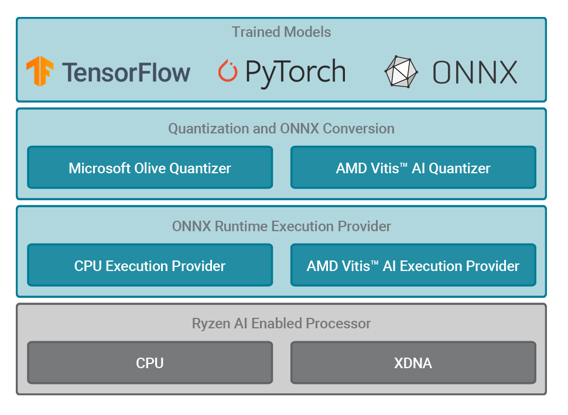

##########################
Ryzen AI Software Platform  
##########################

The AMD Ryzen™ AI Software Platform enables developers to take machine learning models trained in PyTorch or TensorFlow and run them on laptops powered by `Ryzen AI <https://www.amd.com/en/products/ryzen-ai>`__. Ryzen AI is a dedicated AI accelerator integrated on-chip with the CPU cores. The Ryzen AI software platform intelligently optimizes tasks and workloads, freeing-up CPU and GPU resources, and ensuring optimal performance at lower power.

|

|
|

*****************
Table of Contents
*****************

Release Notes
===============

* **Release Notes**: Refer to :doc:`relnotes` page.

Getting Started
===============

* **Installation**: Refer to the :doc:`inst` page. 

* **Runtime Setup**: Refer to the :doc:`runtime_setup` page. 

* **Alternate Quantization Flow**: Refer to the :doc:`alternate_quantization_setup` page. 

* **Development Flow Overview**: Refer to the :doc:`devflow` page. 

* **Examples, Demos, and Tutorials**: Refer to the :doc:`examples` page.

Using Your Model
================

* **Model Compatibility**: Refer to the :doc:`modelcompat` page. 

* **Model Quantization**: Refer to the :doc:`modelport` page. 

* **Model Running Using ONNX Runtime**: Refer to the the :doc:`modelrun` page. 

.. toctree::
   :maxdepth: 1
   :caption: Release Notes
   :hidden:

   relnotes.rst

.. toctree::
   :maxdepth: 1
   :caption: Getting Started
   :hidden:

   inst.rst
   runtime_setup.rst
   alternate_quantization_setup.rst 
   devflow.rst
   examples.rst

.. toctree::
   :maxdepth: 1
   :caption: Using Your Model
   :hidden:

   modelcompat.rst
   modelport.rst
   modelrun.rst

..
  ------------
  #####################################
  License
  #####################################
  
  Ryzen AI is licensed under `MIT License <https://github.com/amd/ryzen-ai-documentation/blob/main/License>`_ . Refer to the `LICENSE File <https://github.com/amd/ryzen-ai-documentation/blob/main/License>`_ for the full license text and copyright notice.
