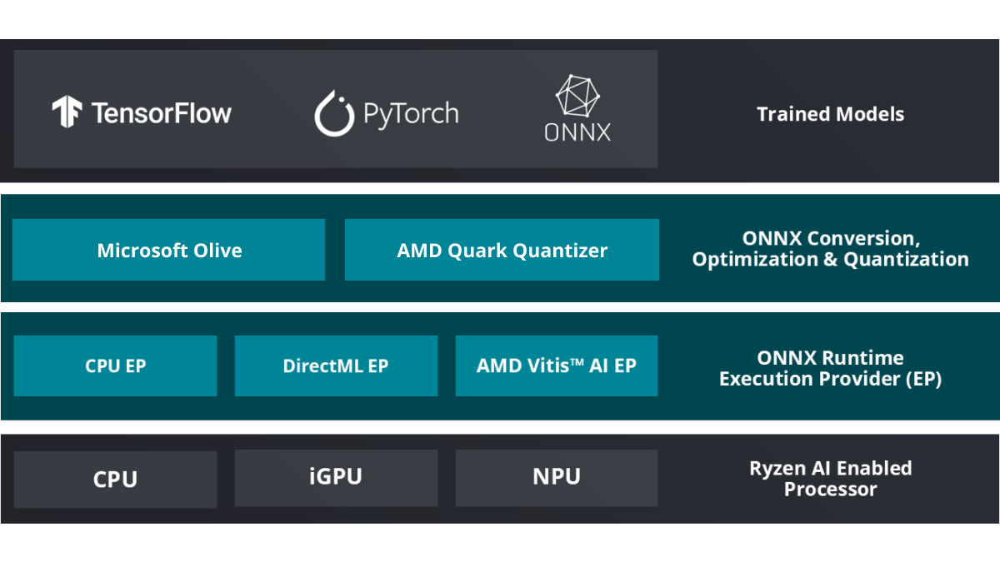

##########################
Ryzen AI Software
##########################

AMD Ryzen™ AI Software includes the tools and runtime libraries for optimizing and deploying AI inference on AMD Ryzen™ AI powered PCs. Ryzen AI software enables applications to run on the neural processing unit (NPU) built in the AMD XDNA™ architecture, as well as on the integrated GPU. This allows developers to build and deploy models trained in PyTorch or TensorFlow and run them directly on laptops powered by Ryzen AI using ONNX Runtime and the Vitis™ AI Execution Provider (EP).

***********
Quick Start
***********

- :ref:`Supported Configurations <supported-configurations>`
- :doc:`inst`
- :doc:`examples`

*************************
Development Flow Overview
*************************

The Ryzen AI development flow does not require any modifications to the existing model training processes and methods. The pre-trained model can be used as the starting point of the Ryzen AI flow.

Quantization
============

Quantization involves converting the AI model’s parameters from floating-point to lower-precision representations, such as 8-bit integer. Quantized models are more power-efficient, utilize less memory, and offer better performance. Ryzen AI Software also supports CNN and Transformer models in floating-point 32 format as input models without quantization. These models are internally converted to bfloat16 and compiled using the bfloat16 compilation flow.

**AMD Quark** is a comprehensive cross-platform deep learning toolkit designed to simplify and enhance the quantization of deep learning models. Supporting both PyTorch and ONNX models, Quark empowers developers to optimize their models for deployment on a wide range of hardware backends, achieving significant performance gains without compromising accuracy.

For more details, refer to the :doc:`model_quantization` page.

CNN/Transformer Compilation and Deployment
==========================================
The AI model is deployed using the ONNX Runtime with either C++ or Python APIs. The Vitis AI Execution Provider included in the ONNX Runtime intelligently determines what portions of the AI model should run on the NPU, optimizing workloads to ensure optimal performance with lower power consumption.

For more details, refer to the :doc:`modelrun` page.

*****************
LLM Flow Overview
*****************

The Ryzen AI LLM software stack is available through three development interfaces, each suited for specific use cases as outlined in the sections below. All three interfaces are built on top of native OnnxRuntime GenAI (OGA) libraries or llama.cpp libraries, as shown in the :ref:`llm-software-stack-table` diagram below.

The **high-level Python APIs**, as well as the **Server Interface**, also leverage the **Lemonade SDK**, which is multi-vendor open-source software that provides everything necessary for quickly getting started with LLMs on OGA or llama.cpp.

At the bottom, **OnnxRuntime GenAI (OGA)** or llama.cpp (only supported for iGPU)  API is the lowest-level API available for building LLM applications on a Ryzen AI PC. 

.. _llm-software-stack-table:

.. flat-table:: Ryzen AI Software Stack
   :header-rows: 1
   :class: center-table

   * - Your Python Application
     - Your LLM Stack
     - Your Native Application
   * - `Lemonade Python API* <#high-level-python-sdk>`_
     - `Lemonade Server Interface* <#server-interface-rest-api>`_
     - `OGA C++ Headers <../hybrid_oga.html>`_ **OR** `llama.cpp C++ Headers <https://github.com/ggml-org/llama.cpp>`_
   * - :cspan:`2` `Custom AMD OnnxRuntime GenAI (OGA) <https://github.com/microsoft/onnxruntime-genai>`_ **OR** `llama.cpp* <https://github.com/ggml-org/llama.cpp>`_
   * - :cspan:`2` `AMD Ryzen AI Driver and Hardware <https://www.amd.com/en/products/processors/consumer/ryzen-ai.html>`_

For more details, refer to the :doc:`llm/overview` page.

|
|

.. toctree::
   :maxdepth: 1
   :hidden:

   relnotes.rst

.. toctree::
   :maxdepth: 1
   :hidden:
   :caption: Getting Started on the NPU

   inst.rst
   examples.rst

.. toctree::
   :maxdepth: 1
   :hidden:
   :caption: Running Models on the NPU

   model_quantization.rst
   modelrun.rst
   app_development.rst

.. toctree::
   :maxdepth: 1
   :hidden:
   :caption: Running LLMs on the NPU

   llm/overview.rst
   llm/server_interface.rst
   llm/high_level_python.rst
   hybrid_oga.rst
   oga_model_prepare.rst

.. toctree::
   :maxdepth: 1
   :hidden:
   :caption: Running Models on the GPU

   gpu/ryzenai_gpu.rst

.. toctree::
   :maxdepth: 1
   :hidden:
   :caption: Additional Topics

   Linux Installation <linux.rst>
   NPU Management <xrt_smi.rst>
   ai_analyzer.rst
   sd_demo.rst
   ryzen_ai_libraries.rst
   Supported Operators <ops_support.rst>
   Licensing Information <licenses.rst>

..
  ------------
  #####################################
  License
  #####################################

  Ryzen AI is licensed under `MIT License <https://github.com/amd/ryzen-ai-documentation/blob/main/License>`_ . Refer to the `LICENSE File <https://github.com/amd/ryzen-ai-documentation/blob/main/License>`_ for the full license text and copyright notice.
