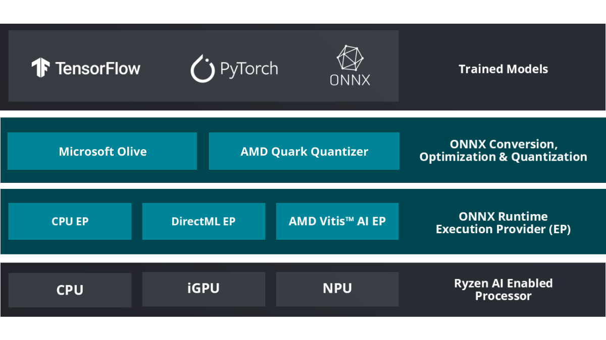

##########################
Ryzen AI Software
##########################

AMD Ryzen™ AI Software includes the tools and runtime libraries for optimizing and deploying AI inference on AMD Ryzen™ AI powered PCs. Ryzen AI software enables applications to run on the neural processing unit (NPU) built in the AMD XDNA™ architecture, as well as on the integrated GPU. This allows developers to build and deploy models trained in PyTorch or TensorFlow and run them directly on laptops powered by Ryzen AI using ONNX Runtime and the Vitis™ AI Execution Provider (EP).

***********
Quick Start
***********

- :ref:`Supported Configurations <supported-configurations>`
- :doc:`inst`
- :doc:`examples`

*************************
Development Flow Overview
*************************

The Ryzen AI development flow does not require any modifications to the existing model training processes and methods. You can use the pre-trained model as the starting point for the Ryzen AI flow.

Quantization
============

Quantization involves converting the AI model’s parameters from floating-point to lower-precision representations, such as 8-bit integer. Quantized models are more power-efficient, use less memory, and offer better performance. Ryzen AI Software also supports CNN and Transformer models in floating-point 32 format as input models without quantization. These models are internally converted to bfloat16 and compiled using the bfloat16 compilation flow.

**AMD Quark** is a comprehensive cross-platform deep learning toolkit designed to simplify and enhance the quantization of deep learning models. Quark supports both PyTorch and ONNX models. It empowers developers to optimize models for deployment across diverse hardware backends, achieving significant performance gains without compromising accuracy.

For more details, refer to the :doc:`model_quantization` page.

Compilation and Deployment
==========================
You can deply the AI model using the ONNX Runtime with either C++ or Python APIs. The Vitis AI Execution Provider included in the ONNX Runtime intelligently determines what portions of the AI model to run on the NPU. It optimizes the workloads to ensure optimal performance with lower power consumption.

For more details, refer to the :doc:`modelrun` page.

|
|

.. toctree::
   :maxdepth: 1
   :hidden:

   relnotes.rst

.. toctree::
   :maxdepth: 1
   :hidden:
   :caption: Getting Started on the NPU

   inst.rst
   examples.rst

.. toctree::
   :maxdepth: 1
   :hidden:
   :caption: Running Models on the NPU

   model_quantization.rst
   modelrun.rst
   app_development.rst

.. toctree::
   :maxdepth: 1
   :hidden:
   :caption: Running LLMs on the NPU

   llm/overview.rst
   llm/server_interface.rst
   llm/high_level_python.rst
   hybrid_oga.rst
   oga_model_prepare.rst

.. toctree::
   :maxdepth: 1
   :hidden:
   :caption: Running Models on the GPU

   gpu/ryzenai_gpu.rst

.. toctree::
   :maxdepth: 1
   :hidden:
   :caption: Additional Topics

   xrt_smi.rst
   ai_analyzer.rst
   sd_demo.rst
   ryzen_ai_libraries.rst
   Licensing Information <licenses.rst>

..
  ------------
  #####################################
  License
  #####################################

  Ryzen AI is licensed under `MIT License <https://github.com/amd/ryzen-ai-documentation/blob/main/License>`_ . Refer to the `LICENSE File <https://github.com/amd/ryzen-ai-documentation/blob/main/License>`_ for the full license text and copyright notice.
