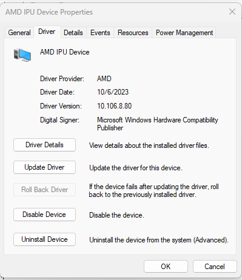

############
Installation 
############

************************
Supported Configurations
************************

The Ryzen AI Software supports AMD Ryzen 7040U, 7040HS series mobile processors with Windows 11 OS.

*********************
Prepare Client Device 
*********************

Download the `IPU Driver <https://account.amd.com/en/forms/downloads/ryzen-ai-software-platform-xef.html?filename=ipu_stack_rel_silicon_2309.zip>`_ and install it by following these steps:

1. Extract the downloaded zip file.
2. Open a terminal in administrator mode and execute the ``.\amd_install_kipudrv.bat`` bat file.

Ensure that the IPU driver is installed from ``Device Manager`` -> ``System Devices`` -> ``AMD IPU Device`` as shown in the following image.

|
|

Note: If you see the "Windows could not verify the digital signature of this driver" error message, follow `this tutorial <https://pureinfotech.com/disable-driver-signature-enforcement-windows-11/>`_ to disable signature checking.

To enable the development and deployment of IPU-based inference on the client device, you must have the following software installed, along with their minimum versions.

.. list-table:: 
   :widths: 25 25 
   :header-rows: 1

   * - Dependencies
     - Version Requirement
   * - Visual Studio
     - 2019
   * - cmake
     - version >= 3.26
   * - python
     - version >= 3.9 
   * - Anaconda or Miniconda
     - Latest version

|
|

.. _install-bundeld:

******************
Installation Steps
******************

Download the setup package ``ryzen-ai-sw-1.0.zip`` and extract. 

https://account.amd.com/en/forms/downloads/ryzen-ai-software-platform-xef.html?filename=ryzen-ai-sw-1.0.zip

Before running the installation script ensure all the prerequisites outlined previously have been met and the Windows PATH variable is properly set for each component. Ensure to set the PATH variable using *Environment Variables* window from the *System Properties*. For example, Anaconda requires following paths to set the PATH variable ``path\to\anaconda3\``, ``path\to\anaconda3\Scripts\``, ``path\to\anaconda3\Lib\bin\``.     

Open a ``Anaconda Command Prompt`` (or ``Windows Command Prompt``) and run the below command 

.. code:: 

    .\install.bat

The installation script, ``install.bat`` does the following: 

- Creates a conda environment 
- Installs :doc:`vai_quant/vai_q_onnx`
- Installs `ONNX Runtime <https://onnxruntime.ai/>`_
- Installs :doc:`Vitis AI Execution Provider <modelrun>`
- Sets the environment variable to specify 1x4.xclbin binary
- Prints the name of the conda environment before exiting 

The default Ryzen AI Software packages are now installed inside the conda environment created by the installer. You can start using it by activating the conda environment created by the installer (check the name it prints during the installation process). Ensure that the specified runtime environment requirements are met as follows.

.. note:: 

   - To provide a specific name of the conda work environment run the ``install.bat``:

     .. code::

        .\install.bat -env <env name>

   - Instead of the bundled installation process using ``install.bat``, if you choose to install each component manually refer to the :doc:`manual_installation` page.

   - To use your existing conda environment for Ryzen AI software, follow the :doc:`manual_installation` and manually install Vitis AI ONNX Quantizer, ONNX Runtime, and Vitis AI Execution Provider, without creating a new conda environment.

   - If you need to install Vitis AI PyTorch/TensorFlow or Microsoft Olive Quantizer, refer to the :doc:`alternate_quantization_setup` page. 

|
|
   
*************************
Runtime Environment Setup 
*************************
   
Runtime IPU Binary Selection
============================

The IPU binaries are located inside the setup package. Selecting an IPU binary is necessary every time the application is run from a new environment. 

The automatic installer ``install.bat`` sets IPU binary 1x4.xclbin as default. However, Ryzen AI Software provides multiple IPU binaries using different configurations on the IPU device. Refer to the :doc:`runtime_setup` page for more details on IPU binaries.

Runtime Configuration File
==========================

The Execution Provider setup package contains the Vitis AI Execution Provider runtime configuration file ``vaip_config.json``. This file is required when configuring Vitis AI Execution Provider (VAI EP) inside the ONNX Runtime code.

Test Installation
=================

The setup package ``ryzen-ai-sw-1.0`` contains a ``quicktest`` folder to help test the setup. 

Run the command: 

.. code-block::

   cd ryzen-ai-sw-1.0\ryzen-ai-sw-1.0\quicktest
   python -m pip install -r requirements.txt
   python quicktest.py –ep ipu

- This test takes an image and run classification on IPU. On a successful run, you can see an output similar to the following:

.. code-block::
  
   I20231127 16:29:15.010130 13892 vitisai_compile_model.cpp:336] Vitis AI EP Load ONNX Model Success
   I20231127 16:29:15.010130 13892 vitisai_compile_model.cpp:337] Graph Input Node Name/Shape (1)
   I20231127 16:29:15.010130 13892 vitisai_compile_model.cpp:341]   input : [-1x3x32x32]
   I20231127 16:29:15.010130 13892 vitisai_compile_model.cpp:347] Graph Output Node Name/Shape (1)
   I20231127 16:29:15.010130 13892 vitisai_compile_model.cpp:351]   output : [-1x10]
   I20231127 16:29:15.010130 13892 vitisai_compile_model.cpp:226] use cache key quickstart_modelcachekey
   [Vitis AI EP] No. of Operators :   CPU     2    IPU   400  99.50%
   [Vitis AI EP] No. of Subgraphs :   CPU     1    IPU     1 Actually running on IPU     1
   ....

..
  ------------

  #####################################
  License
  #####################################

 Ryzen AI is licensed under `MIT License <https://github.com/amd/ryzen-ai-documentation/blob/main/License>`_ . Refer to the `LICENSE File <https://github.com/amd/ryzen-ai-documentation/blob/main/License>`_ for the full license text and copyright notice.
