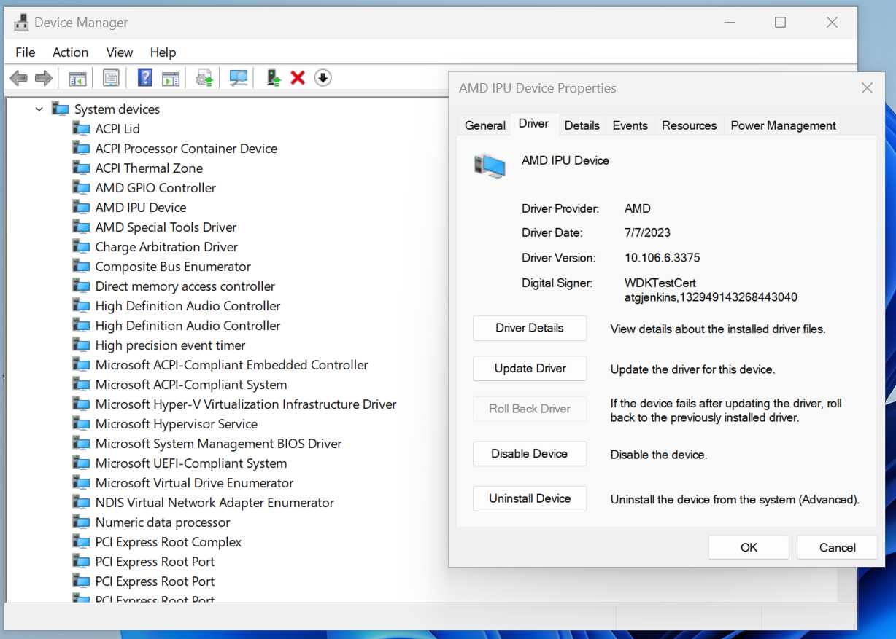

.. _inst.rst:

############
Installation 
############

Supported Configurations
~~~~~~~~~~~~~~~~~~~~~~~~

The Ryzen AI Software Platform supports AMD Ryzen 7040U, 7040HS series mobile processors with Windows 11 OS.

Ensure that the IPU driver is installed by opening ``Device Manager`` -> ``System Devices`` -> ``AMD IPU Device`` as shown in the following image.

|
|

This release is compatible with IPU driver version >= 10.105.5.42. For Ryzen AI laptops with earlier IPU driver versions such as 10.105.5.38, please download the `IPU Driver <https://account.amd.com/en/forms/downloads/ryzen-ai-software-platform-xef.html?filename=ipu_stack_rel_silicon.zip>`_ and install it as explained below

1. Extract the downloaded package ipu_stack_rel_silicon.zip
2. Open a terminal in administrator mode and execute bat file ``.\amd_install_kipudrv.bat``

Note: If you see an error saying that "Windows could not verify the digital signature of this driver" follow `this tutorial <https://pureinfotech.com/disable-driver-signature-enforcement-windows-11/>`_ to disable signature checking."

|
|

Prepare Client Device 
~~~~~~~~~~~~~~~~~~~~~

To enable the development and deployment of IPU-based inference on the client device, it is required to have the following software installed, along with their minimum versions. 

.. list-table:: 
   :widths: 25 25 
   :header-rows: 1

   * - Dependencies
     - Version Requirement
   * - Visual Studio
     - 2019
   * - cmake
     - version >= 3.26
   * - python
     - version >= 3.9 (3.9.13 64bit recommended) 
   * - Anaconda or Miniconda
     - Latest version
   * - AMD IPU driver
     - >= 10.105.5.42

|
|

Installation Steps
~~~~~~~~~~~~~~~~~~

The Ryzen AI Software Platform requires using a conda environment (Anaconda or Miniconda) for the installation process. 

Start a conda prompt. In the conda prompt, create and activate an environment for the rest of the installation process. 

.. code-block:: 

  conda create --name <name> python=3.9
  conda activate <name> 

.. _install-olive:

Install Quantizer
#################

Ryzen AI Software platform provides multiple quantization flow support

**Vitis AI ONNX Quantization** 

Vitis AI ONNX Quantization is post-training quantization that works on the models saved in ONNX format. To install download the installation file and follow the command:

https://www.xilinx.com/bin/public/openDownload?filename=vai_q_onnx-1.14.0-py2.py3-none-any.whl

.. code-block::

   pip install vai_q_onnx-1.14.0-py2.py3-none-any.whl

**Olive Quantization**

Microsoft Olive framework can be used for Vitis AI ONNX Quantization. 

.. code-block::

   pip install olive-ai[cpu]

Note: Current Olive flow is not compatible with the latest pydantic version. Downgrade the pydantic version as shown below

.. code-block::

    pip install pydantic==1.10.9

For additional information regarding the Olive installation, refer to the Microsoft documentation:       
https://microsoft.github.io/Olive/getstarted/installation.html

**PyTorch/Tensorflow 2/Tensorflow Quantization**

Vitis AI PyTorch and Tensorflow Quantizer, which is part of the Vitis AI toolchain, require the installation of a Docker container on the host server.

The Vitis AI Docker container can be installed on Ubuntu 20.04, CentOS 7.8, 7.9, 8.1, and RHEL 8.3, 8.4. The developers working on Windows 11 can use WSL for installing Vitis AI docker.

Multiple versions of the Docker container are available, each tailored to specific frameworks. Please follow the docker download and running instructions as per the following links

.. list-table:: 
   :widths: 25 25 
   :header-rows: 1

   * - Framework
     - Docker location
   * - PyTorch
     - https://hub.docker.com/r/amdih/ryzen-ai-pytorch
   * - Tensorflow 2
     - https://hub.docker.com/r/amdih/ryzen-ai-tensorflow2
   * - Tensorflow 1
     - https://hub.docker.com/r/amdih/ryzen-ai-tensorflow 

Install ONNX Runtime
####################

.. code-block::
   
   pip install onnxruntime 

Install Vitis AI Execution Provider
###################################

Download and extract the Execution Provider setup package:

https://account.amd.com/en/forms/downloads/ryzen-ai-software-platform-xef.html?filename=voe-3.5-win_amd64.zip 

Install the necessary packages:

Change the directory to the extracted Execution Provider setup package directory:

.. code-block:: 
   
   cd voe-3.5-win_amd64\voe-3.5-win_amd64
   
Install packages:

.. code-block:: 

     python installer.py
     pip install voe-0.1.0-cp39-cp39-win_amd64.whl
     pip install onnxruntime_vitisai-1.15.1-cp39-cp39-win_amd64.whl

|
|
   
Runtime Environment Setup 
~~~~~~~~~~~~~~~~~~~~~~~~~
   
.. _set-vart-envar:

1. Select the IPU binary. It is a required step everytime the application is run from a new terminal:

.. code-block::

   set XLNX_VART_FIRMWARE=C:\path\to\1x4.xclbin

The IPU binaries are located inside the Execution Provider setup package.

.. _copy-vaip-config:

2. The Execution Provider setup package (``voe-3.5-win_amd64.zip``) contains the Vitis AI Execution Provider runtime configuration file ``vaip_config.json``. This file is required when configuring Vitis AI Execution Provider (VAI EP) inside the ONNX Runtime code. 

Runtime IPU Binary selection 
~~~~~~~~~~~~~~~~~~~~~~~~~~~~

Ryzen AI Software platform provides a couple of IPU binaries using different configurations on the IPU device. 

**IPU binary 1x4.xclbin**: An AI stream using 1x4.xclbin use a 1x4 grid-style configuration on the IPU device that provides up to 2 TOPS performance. Most real-time application (video conferencing use cases) performance requirements can be met using this configuration. In the current Ryzen AI software platform, up to four such AI streams can be run in parallel on the IPU device without any visible loss of performance.

**IPU binary 5x4.xclbin**: For more advanced use cases or larger models, IPU binary 5x4.xclbin can be used which uses a larger 5x4 grid-style configuration that occupies the complete IPU device to provide up to 10 TOPs performance. 

In the current version of the release, 5x4.xclbin does not support multiple concurrent AI streams, and can only be used by a single application. 

The procedure of selecting a specific binary by using the environment variables is shown below:

Selecting the 1x4.xclbin IPU binary

.. code-block::

   set XLNX_VART_FIRMWARE=C:\path\to\1x4.xclbin

Selecting the 5x4.xclbin IPU binary

.. code-block::

   set XLNX_VART_FIRMWARE=C:\path\to\5x4.xclbin
   set XLNX_TARGET_NAME="AMD_AIE2_5x4_Overlay"

Note: To select the 5x4.xclbin as the IPU binary, the additional XLNX_TARGET_NAME environment variable is required. 

..
  ------------

  #####################################
  License
  #####################################

 Ryzen AI is licensed under `MIT License <https://github.com/amd/ryzen-ai-documentation/blob/main/License>`_ . Refer to the `LICENSE File <https://github.com/amd/ryzen-ai-documentation/blob/main/License>`_ for the full license text and copyright notice.
