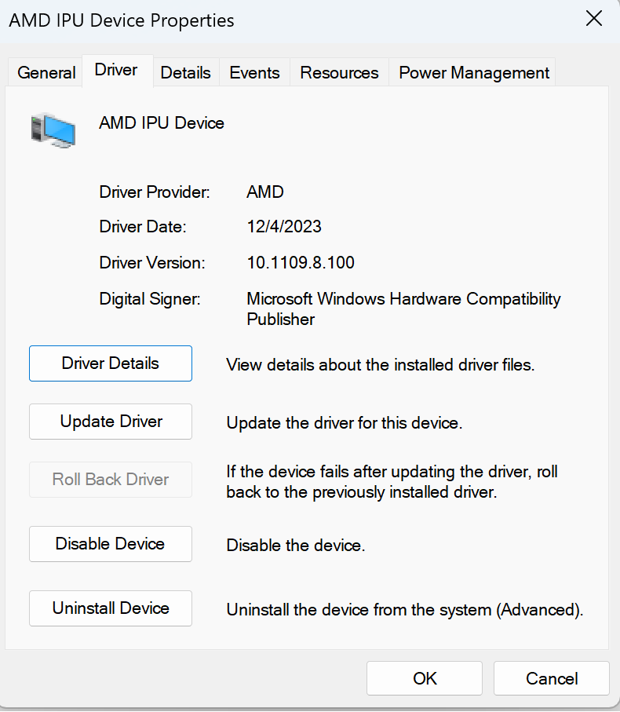

#########################
Installation Instructions
#########################

************************
Supported Configurations
************************

The Ryzen AI Software supports the AMD Ryzen™ 7940HS, 7840HS, 7640HS, 7840U and 7640U processors running Windows 11. 

******************
Prepare the System
******************

Download the :download:`IPU Driver <https://account.amd.com/en/forms/downloads/ryzen-ai-software-platform-xef.html?filename=ipu_stack_rel_silicon_1.0.zip>` and install it by following these steps:

1. Extract the downloaded zip file.
2. Open a terminal in administrator mode and execute the ``.\amd_install_kipudrv.bat`` bat file.

Ensure that the IPU driver is installed from ``Device Manager`` -> ``System Devices`` -> ``AMD IPU Device`` as shown in the following image.

|
|

To enable the development and deployment of applications leveraging the IPU, you must have the following software installed on the system.

.. list-table:: 
   :widths: 25 25 
   :header-rows: 1

   * - Dependencies
     - Version Requirement
   * - Visual Studio
     - 2019
   * - cmake
     - version >= 3.26
   * - python
     - version >= 3.9 
   * - Anaconda or Miniconda
     - Latest version

|
|

.. _install-bundled:

*****************************
Install the Ryzen AI Software
*****************************

Before installing the Ryzen AI Software, ensure that all the prerequisites outlined previously have been met and that the Windows PATH variable is properly set for each component. For example, Anaconda requires following paths to be set in the PATH variable ``path\to\anaconda3\``, ``path\to\anaconda3\Scripts\``, ``path\to\anaconda3\Lib\bin\``. The PATH variable should be set through the *Environment Variables* window of the *System Properties*. 

Download the :download:`ryzen-ai-sw-1.0.zip <https://account.amd.com/en/forms/downloads/ryzen-ai-software-platform-xef.html?filename=ryzen-ai-sw-1.0.zip>` Ryzen AI Software installation package and extract it. 

Open an Anaconda or Windows command prompt in the extracted folder and run the installation script as shown below. Make sure to enter "Y" when prompted to accept the EULA. 

.. code:: 

    .\install.bat

The ``install.bat`` script does the following: 

- Creates a conda environment 
- Installs the :doc:`vai_quant/vai_q_onnx`
- Installs the `ONNX Runtime <https://onnxruntime.ai/>`_
- Installs the :doc:`Vitis AI Execution Provider <modelrun>`
- Configures the environment to use the throughput profile of the IPU
- Prints the name of the conda environment before exiting 

The default Ryzen AI Software packages are now installed in the conda environment created by the installer. You can start using the Ryzen AI Software by activating the conda environment created by the installer (the name of the environment is printed during the installation process). 

**IMPORTANT:** The Ryzen AI Software installation folder (where the zip file was extracted) contains various files required at runtime by the inference session. These files include the IPU binaries (:file:`*.xclbin`) and the default runtime configuration file (:file:`vaip_config.json`) for the Vitis AI Execution Provider. Because of this, the installation folder should not be deleted and should be kept in a convenient location. Refer to the :doc:`runtime_setup` page for more details about setting up the environment before running an inference session on the IPU.

.. rubric:: Customizing the Installation

- To specify the name of the conda work environment created by the installer, run the script as follows:

.. code::

   .\install.bat -env <env name>

- Instead of the automated installation process, you can install each component manually by following the instructions on the :doc:`manual_installation` page.

- To use your existing conda environment with the Ryzen AI software, follow the :doc:`manual_installation` instructions and manually install the Vitis AI ONNX Quantizer, the ONNX Runtime, and the Vitis AI Execution Provider, without creating a new conda environment.

- If you need to install the Vitis AI PyTorch/TensorFlow Quantizer or the Microsoft Olive Quantizer, refer to the :doc:`alternate_quantization_setup` page. 

|
|

*********************
Test the Installation
*********************

The ``ryzen-ai-sw-1.0`` package contains a test to verify that the Ryzen AI software is correctly installed. This installation test can be found in the ``quicktest`` folder.

- Download an image from the CIFAR-10 dataset and name it ``image_0.png``: 

.. code-block::

   cd ryzen-ai-sw-1.0\ryzen-ai-sw-1.0\quicktest
   curl https://www.cs.toronto.edu/~kriz/cifar-10-sample/bird6.png --output image_0.png

- Run the test as follows: 

.. code-block::

   python -m pip install -r requirements.txt
   python quicktest.py --ep ipu

- The test runs image classification on the IPU. On a successful run, you will see an output similar to the one shown below:

.. code-block::
  
   I20231127 16:29:15.010130 13892 vitisai_compile_model.cpp:336] Vitis AI EP Load ONNX Model Success
   I20231127 16:29:15.010130 13892 vitisai_compile_model.cpp:337] Graph Input Node Name/Shape (1)
   I20231127 16:29:15.010130 13892 vitisai_compile_model.cpp:341]   input : [-1x3x32x32]
   I20231127 16:29:15.010130 13892 vitisai_compile_model.cpp:347] Graph Output Node Name/Shape (1)
   I20231127 16:29:15.010130 13892 vitisai_compile_model.cpp:351]   output : [-1x10]
   I20231127 16:29:15.010130 13892 vitisai_compile_model.cpp:226] use cache key quickstart_modelcachekey
   [Vitis AI EP] No. of Operators :   CPU     2    IPU   400  99.50%
   [Vitis AI EP] No. of Subgraphs :   CPU     1    IPU     1 Actually running on IPU     1
   ....

..
  ------------

  #####################################
  License
  #####################################

 Ryzen AI is licensed under `MIT License <https://github.com/amd/ryzen-ai-documentation/blob/main/License>`_ . Refer to the `LICENSE File <https://github.com/amd/ryzen-ai-documentation/blob/main/License>`_ for the full license text and copyright notice.
