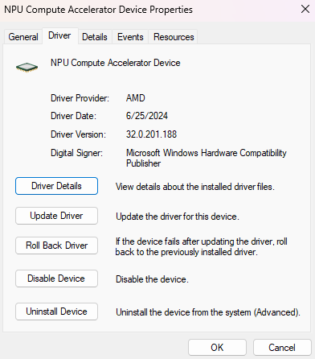

.. include:: icons.txt

#########################
Installation Instructions
#########################

************************
Supported Configurations
************************

The Ryzen AI Software supports the following processors running Windows 11

- Phoenix (PHX): AMD Ryzen™ 7940HS, 7840HS, 7640HS, 7840U, 7640U.
- Hawk (HPT): AMD Ryzen™ 8640U, 8640HS, 8645H, 8840U, 8840HS, 8845H, 8945H.
- Strix (STX): AMD Ryzen™ Ryzen AI 9 HX370, Ryzen AI 9 365

The rest of this document will refer to Phoenix as PHX, Hawk as HPT, and Strix as STX.

.. note::
   In this documentation, "NPU" is used in descriptions, while "IPU" is retained in the tool's language, code, screenshots, and commands. This intentional 
   distinction aligns with existing tool references and does not affect functionality. Avoid making replacements in the code.

******************
Prerequisites
******************

To enable the development and deployment of applications leveraging the NPU, you must have the following software installed on the system.

.. list-table:: 
   :widths: 25 25 
   :header-rows: 1

   * - Dependencies
     - Version Requirement
   * - Visual Studio
     - 2022
   * - cmake
     - version >= 3.26
   * - Anaconda or Miniconda
     - Latest version

|

|warning| **IMPORTANT**: 

- Visual Studio 2022 Community: ensure that "Desktop Development with C++" is installed

- Anaconda or Miniconda: ensure that the following path is set in the System PATH variable: ``path\to\anaconda3\Scripts`` or ``path\to\miniconda3\Scripts`` (The System PATH variable should be set in the *System Variables* section of the *Environment Variables* window). 

|

*******************
Install NPU Drivers
*******************

- Download the NPU driver installation package :download:`NPU Driver <http://xcoartifactory/ui/native/aie-ipu-prod-local/com/xilinx/ryzenai-installer/npu-driver/rai-1.2-ea1/ipu-driver-1_2.zip>` 

- Install the NPU drivers by following these steps:

  - Extract the downloaded ``ipu-driver-1_2.zip`` zip file.
  - Extract the ``RYZEN AI RELEASE 1.2 <Tag>.zip`` zip file.
  - Open a terminal in administrator mode and execute the ``.\npu_sw_installer.exe`` exe file.

- Ensure that the NPU MCDM driver is correctly installed by opening ``Device Manager`` -> ``Neural processors`` -> ``NPU Compute Accelerator Device`` as shown in the following image.

|

|memo| **NOTE**: On PHX hardware with a Windows OS build < 22631.3527, a WDF driver is installed instead. This driver can be inspected by opening ``Device Manager`` -> ``System Devices`` -> ``AMD IPU Device``

|

.. _install-bundled:

*****************************
Install the Ryzen AI Software
*****************************

- Download the RyzenAI Software MSI installer :download:`ryzenai-1.2.0.msi <https://xcoartifactory:443/artifactory/aie-ipu-prod-local/com/xilinx/ryzenai-installer/main/118/ryzenai-1.2.0.msi>`.

- Launch the MSI installer and follow the instructions on the installation wizard:

  - Accept the terms of the Licence agreement
  - Provide the destination folder for Ryzen AI installation (default: ``C:\Program Files\RyzenAI\1.2.0``)
  - Specify the name for the conda environment (default: ``ryzen-ai-1.2.0``)

The Ryzen AI Software packages are now installed in the conda environment created by the installer. Refer to the :doc:`runtime_setup` page for more details about setting up the environment before running an inference session on the NPU.

.. _quicktest:

*********************
Test the Installation
*********************

The Ryzen AI Software installation folder contains test to verify that the software is correctly installed. This installation test can be found in the ``quicktest`` subfolder.

- Open a Conda command prompt (search for "Anaconda Prompt" in the Windows start menu)

- Activate the Conda environment created by the Ryzen AI installer:

.. code-block::

   conda activate <env_name>

- Run the test: 

.. code-block::

   cd %RYZEN_AI_INSTALLATION_PATH%/quicktest
   python quicktest.py

- The quicktest.py script sets up the environment and runs a simple CNN model. On a successful run, you will see an output similar to the one shown below. This indicates that the model is running on the NPU and that the installation of the Ryzen AI Software was successful:

.. code-block::
  
   [Vitis AI EP] No. of Operators :   CPU     2    IPU   398  99.50%
   [Vitis AI EP] No. of Subgraphs :   CPU     1    IPU     1 Actually running on IPU     1
   ...
   Test Passed
   ...

*************************
Additional Considerations
*************************

- The full path to the Ryzen AI Software installation folder is stored in the ``RYZEN_AI_INSTALLATION_PATH`` environment variable. 

- To install the Ryzen AI Software in a pre-existing conda environment, follow the :doc:`manual_installation` instructions.

- If you need to install the Vitis AI PyTorch/TensorFlow Quantizer or the Microsoft Olive Quantizer, refer to the :doc:`alternate_quantization_setup` page. 

..
  ------------

  #####################################
  License
  #####################################

 Ryzen AI is licensed under `MIT License <https://github.com/amd/ryzen-ai-documentation/blob/main/License>`_ . Refer to the `LICENSE File <https://github.com/amd/ryzen-ai-documentation/blob/main/License>`_ for the full license text and copyright notice.
