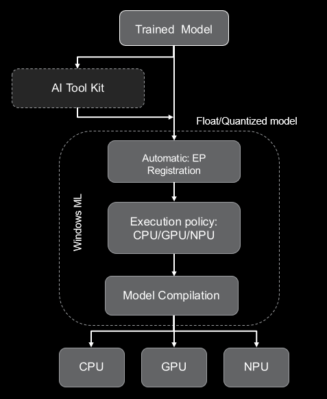

################
Model Deployment
################

Windows Machine Learning (WinML) enables C#, C++, and Python developers to run ONNX AI models locally on Windows PCs through ONNX Runtime, with automatic execution provider management across hardware targets including CPUs, GPUs, and NPUs. You can use models from PyTorch, TensorFlow/Keras, TensorFlow Lite (TFLite), scikit-learn, and other frameworks by converting them to ONNX for ONNX Runtime.

In short, Windows ML provides a shared, Windows-wide ONNX Runtime along with support for dynamically downloading execution providers (EPs).

For more details, see the `Windows ML official documentation <https://learn.microsoft.com/en-us/windows/ai/new-windows-ml/overview>`_.

***************************************
Running CNN/Transformer models on NPU
***************************************

Windows ML provides a streamlined workflow for deploying CNN and Transformer models on Ryzen AI PCs. Users can either use the original float model with automatic BF16 conversion, or use AI Toolkit for model quantization (QDQ format).

Windows ML workflow
===================

**Step 1:** Download the Original Float Model

Start with your pre-trained ONNX model in FP32 format. Models can be exported from PyTorch, TensorFlow, or obtained from model repositories.

**Step 2:** Model Quantization using VS AI Toolkit (Optional)

For improved inference performance, quantize your model using VS AI Toolkit or Olive recipe:

- **A8W8 quantization**: Recommended for CNN models (ResNet, MobileNet, etc.)
- **A16W8 quantization**: Recommended for Transformer models (BERT, CLIP etc.)

**Step 3:** Automatic Execution Provider Registration

Windows ML automatically downloads and registers the appropriate execution providers based on available hardware:

.. list-table::
   :widths: 35 65
   :header-rows: 1

   * - Execution Provider
     - Hardware Target
   * - VitisAIExecutionProvider
     - AMD Ryzen AI NPU
   * - MIGraphXExecutionProvider
     - AMD GPU (ROCm)
   * - DmlExecutionProvider
     - DirectML (GPU/NPU)

**Step 4:** Execution Policy for device selection

Select the preferred execution target using the execution policy:

.. list-table::
   :widths: 30 70
   :header-rows: 1

   * - Execution Policy
     - First Preference EP
   * - PREFER_CPU
     - CPUExecutionProvider
   * - PREFER_GPU
     - DmlExecutionProvider
   * - PREFER_NPU
     - VitisAIExecutionProvider

The EP selection policy can be configured to use a specific execution provider or through general execution policy. For more details, refer to the Windows ML documentation on :doc:`Execution Providers <winml_ep>`.

**Step 5:** Model Compilation

The model is compiled for the target hardware:

- **Float models**: VAIML performs automatic BF16 conversion for NPU execution
- **Quantized models**: A8W8/A16W8 models are compiled using X2/X1 compiler

For more details refer to the :doc:`model compilation and deployment <../modelrun>` documentation.

**Step 6:** Model Inference

Use the ONNX Runtime APIs to run inference on the compiled model. The model will execute on the selected hardware target based on the execution policy and available EPs.

*************************
Running LLM models on NPU
*************************

Windows ML enables support for Foundry Local models for on-device AI inference solutions that provide privacy and performance. Currently, Foundry Local is available in preview mode. It automatically detects NPU and downloads the compatible model for the NPU device.

LLM prerequisites
=================

Make sure the following requirements are met before proceeding:

.. list-table::
   :widths: 30 70
   :header-rows: 1

   * - Requirement
     - Details
   * - Operating System
     - Windows 10, Windows 11
   * - Hardware (Minimum)
     - 8 GB RAM, 3 GB free disk space
   * - Hardware (Recommended)
     - 16 GB RAM, 15 GB free disk space
   * - Acceleration
     - AMD NPU

Running LLM on AMD NPU
======================

LLM models can be run on AMD NPU using Foundry Local or Windows ML APIs. Foundry Local provides an easy-to-use interface for running LLM models on AMD NPU, while Windows ML APIs allow for more customization and control over the inference process.

**Option 1:** Running LLM using Foundry Local

This is the recommended option for most users as it provides a simple and efficient way to run LLM models on AMD NPU without needing to manage dependencies or optimize the model manually.

**Option 2:** Running a Custom LLM Model using Windows ML and OGA APIs

This option allows users to run custom LLM models on AMD NPU using Windows ML APIs. This option is suitable for users who want more control over the inference process and are comfortable managing dependencies and model optimization manually.

For detailed instructions on each option, see the `Running LLM Models on NPU <https://github.com/amd/RyzenAI-SW/tree/main/WinML/LLM>`_ documentation.

..
  ------------

  #####################################
  License
  #####################################

 Ryzen AI is licensed under `MIT License <https://github.com/amd/ryzen-ai-documentation/blob/main/License>`_ . Refer to the `LICENSE File <https://github.com/amd/ryzen-ai-documentation/blob/main/License>`_ for the full license text and copyright notice.
