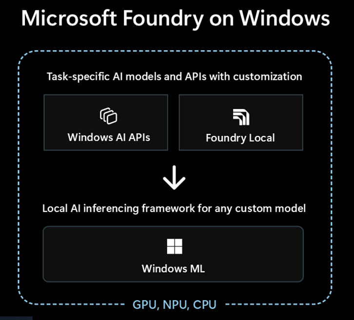

==============================
Windows ML
==============================

Microsoft provides a comprehensive AI platform for Windows that enables developers to build intelligent applications running locally on the device. The platform spans three key pillars: **Windows AI APIs**, **Foundry Local**, and **Windows ML**. For more details, refer to the official documentation, see: `Windows AI Developer Portal <https://developer.microsoft.com/en-us/windows/ai/>`_

Windows Foundry Components
~~~~~~~~~~~~~~~~~~~~~~~~~~

.. list-table::
   :widths: 20 55 25
   :header-rows: 1

   * - Component
     - Description
     - Documentation
   * - Windows AI APIs
     - Built-in system APIs that provide access to pre-trained AI models shipped with Windows. These APIs enable AI capabilities without bundling models, and run entirely on-device for privacy and low-latency inference. Key capabilities include `Text Recognition (OCR) <https://learn.microsoft.com/en-us/windows/ai/apis/text-recognition>`_, `Object Detection <https://learn.microsoft.com/en-us/windows/ai/apis/object-detection>`_, `Image Segmentation <https://learn.microsoft.com/en-us/windows/ai/apis/image-segmentation>`_, `Description <https://learn.microsoft.com/en-us/windows/ai/apis/image-description>`_, and `Language Detection <https://learn.microsoft.com/en-us/windows/ai/apis/language-detection>`_.
     - `Windows AI APIs documentation <https://learn.microsoft.com/en-us/windows/ai/apis/>`_
   * - Foundry Local
     - Microsoft's on-device AI inference runtime for running large language models (LLMs) and other generative AI models locally on Windows PCs. It automatically detects available hardware accelerators (CPU, GPU, NPU) and downloads the most compatible model variant.
     - `Foundry Local documentation <https://learn.microsoft.com/en-us/azure/ai-foundry/foundry-local/get-started>`_
   * - Windows ML
     - Runtime layer that manages ONNX Runtime execution providers and hardware acceleration. It works alongside Windows AI APIs and Foundry Local to provide a unified deployment path for ONNX AI models across CPUs, GPUs, and NPUs.
     - `Windows ML official documentation <https://learn.microsoft.com/en-us/windows/ai/new-windows-ml/overview>`_

************************************
Model Deployment using Windows ML
************************************

Windows Machine Learning (WinML) enables C#, C++, and Python developers to run ONNX AI models locally on Windows PCs through ONNX Runtime, with automatic execution provider management across hardware targets including CPUs, GPUs, and NPUs. You can use models from PyTorch, TensorFlow/Keras, TensorFlow Lite (TFLite), scikit-learn, and other frameworks by converting them to ONNX for ONNX Runtime.

In short, Windows ML provides a shared, Windows-wide ONNX Runtime along with support for dynamically downloading execution providers (EPs).

For more details, see the `Windows ML official documentation <https://learn.microsoft.com/en-us/windows/ai/new-windows-ml/overview>`_.

*************
Prerequisites
*************

.. list-table::
   :widths: 25 25
   :header-rows: 1

   * - Dependency
     - Version Requirement
   * - Windows 11
     - 24H2 (build 26100) or greater
   * - Visual Studio 2022 (for building the C++ application)
     - Latest version
   * - Visual Studio Code with AI Toolkit extension (for AI model conversion)
     - Latest version
   * - C++
     - C++20 or later
   * - Python
     - 3.10 to 3.12

For the complete list of Windows OS that are supported refer to `Windows App SDK support <https://learn.microsoft.com/en-us/windows/apps/windows-app-sdk/support>`_

*************
Installation
*************

- Install the latest NPU drivers following `RAI installation instructions <../inst.rst>`_
- Windows ML is included as part of the Windows App SDK, so installing it will also install Windows ML and its dependencies. Download and install a compatabile version of the `Windows App SDK 1.8.5 <https://learn.microsoft.com/en-us/windows/apps/windows-app-sdk/downloads>`_ or later version.

Key Features
~~~~~~~~~~~~

Windows ML handles the complexity of package management and hardware selection, automatically downloading the latest execution providers compatabile with your device's hardware.

- Dynamically gets latest EPs for different hardware
- Shared Windows-wide ONNX Runtime, which reduces application size
- Broad hardware support across different vendors through ONNX Runtime

******************************
Getting Started Tutorials
******************************

- `Getting Started Tutorial for Windows ML <winml_example.rst>`_ - Using ResNet model:

  -  Optional Model conversion to QDQ quantized ONNX model using `VS Code AI Toolkit <https://code.visualstudio.com/docs/intelligentapps/modelconversion>`_
  - `Deployment using Windows ML APIs and ONNX Runtime using C++ and Python <winml_example.rst>`_

- Additional examples:

  - `Transformer based GoogleBERT example <https://github.com/amd/RyzenAI-SW/tree/main/WinML/Transformers/GoogleBERT>`_
  - `LLM example using Foundry Local <https://github.com/amd/RyzenAI-SW/tree/main/WinML/LLM>`_

..
  ------------

  #####################################
  License
  #####################################

 Ryzen AI is licensed under `MIT License <https://github.com/amd/ryzen-ai-documentation/blob/main/License>`_ . Refer to the `LICENSE File <https://github.com/amd/ryzen-ai-documentation/blob/main/License>`_ for the full license text and copyright notice.
