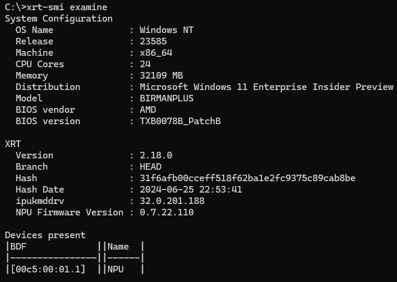
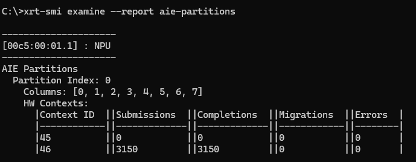
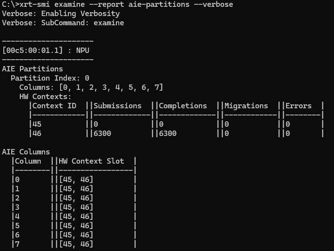
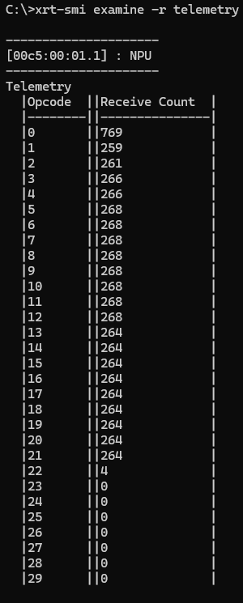
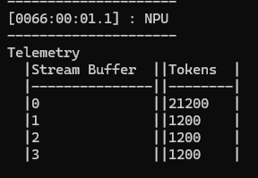
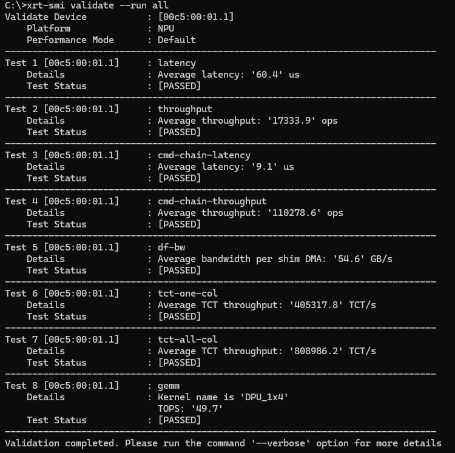
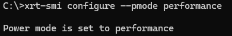

..
.. Heading guidelines
..
..     # with overline, for parts
..     * with overline, for chapters
..     =, for sections
..     -, for subsections
..     ^, for subsubsections
..     “, for paragraphs
..

.. include:: icons.txt

########################
NPU Management Interface
########################

.. note::
   
   This feature is currently in the Early Access stage. Early Access features are features which are still undergoing some optimization and fine-tuning. These features are not in their final form and may change 
   as we continue to work in order to mature them into full-fledged features.

The ``xrt-smi`` utility is a command-line interface to monitor and manage the NPU integrated AMD CPUs. 

It is installed in ``C:\Windows\System32\AMD`` and it can be directly invoked from within the conda environment created by the Ryzen AI Software installer.

The ``xrt-smi`` utility currently supports three primary commands:

- ``examine``: Examines the state of the AI PC and the NPU.
- ``validate``: Executes sanity tests on the NPU.
- ``configure``: Manages the performance level of the NPU.

You can use ``--help`` with any command, such as ``xrt-smi examine --help``, to view all supported subcommands and their details. 

By default, the output of the ``xrt-smi examine`` and ``xrt-smi validate`` commands goes to the terminal. It can also be written to file in JSON format as shown below:  

.. code-block:: shell

    xrt-smi examine -f JSON -o <path/to/output.json>

*******************************
xrt-smi examine
*******************************

System Information
==================

To get OS/system information of the AI PC and confirm the presence of the AMD NPU:

.. code-block:: shell

    xrt-smi examine

*Sample Command Line Output:*

Platform Information
====================

To get more detailed information about the NPU, such as its performance mode and clocks:

.. code-block:: shell

    xrt-smi examine --report platform

*Sample Command Line Output:*

.. image:: images/report_platform.png

NPU Partitions
==============

To get details about the NPU partition and column occupancy on the NPU:

.. code-block:: shell

    xrt-smi examine --report aie-partitions

*Sample Command Line Output:*

NPU Context Bindings
====================

To get details about the columns to NPU HW context binding:

.. code-block:: shell

    xrt-smi examine --report aie-partitions --verbose

*Sample Command Line Output:*

Telemetry
=========

To get details about the ctrlcode opcode trace (on Strix NPU) or stream buffer tokens (on Phonix NPU):

.. code-block:: shell

    xrt-smi examine -r telemetry
  
*Sample Command Line Output on Strix NPU:*

*Sample Command Line Output on Phoenix NPU:*

|memo| **NOTE**: To view ``aie-partition`` and ``telemetry`` reports, the model must be run concurrently on the NPU. For models running for a shorter timespan, you can run the model or xrt-smi commands in a loop to see the output of these commands.

*******************************
xrt-smi validate
*******************************

Executing a Sanity Check on the NPU
===================================

To run a set of built-in NPU sanity tests which includes verify, df-bw, tct and gemm:

.. code-block:: shell

    xrt-smi validate --run <all>

|memo| **NOTE**: Some sanity checks may fail if other applications (for example MEP, Microsoft Experience Package) are also using the NPU. 

*Sample Command Line Output:*
    

*******************************
xrt-smi configure
*******************************

Managing the Performance Level of the NPU
=========================================

To set the performance level of the NPU. You can choose powersaver mode, balanced mode, performance mode, or use the default:

.. code-block:: shell

    xrt-smi configure --pmode <powersaver | balanced | performance | default>

*Sample Command Line Output:*

